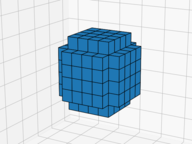
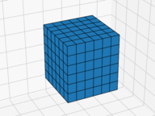
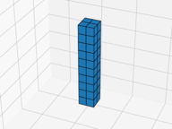
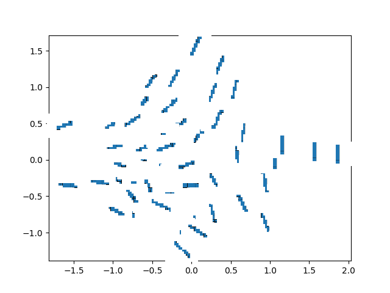
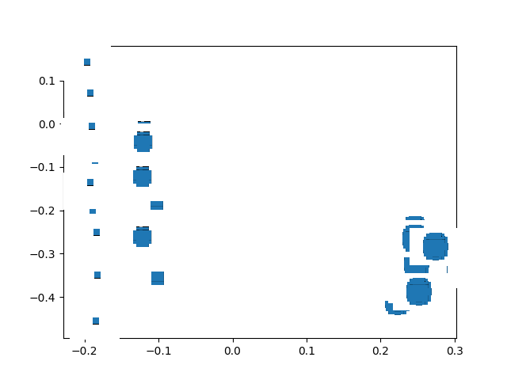

# Occupancy Variational Autoencoder
Variational Autoencoder, based on [Occupancy Networks](https://github.com/autonomousvision/occupancy_networks).

The designed encoder part of the VAE ca process input in form of voxel data. The encoder/network creates a 
latent representation of the input data. The encoder part is designed to take this representation, as well as points
in R^3 and predicts a occupancy probability for those points, if they are inside of the object (represented by the voxeldata).

## Data Generation

In order to generate some toy data to test the capabilities of the network I use [VoxelView](https://github.com/galberding/VoxelView/tree/217b4dc7073696ba147d196c504f8062bb207936)
to generate primative models (spheres, cubes, pens) in different size, rotation and translation.





## Distribution in Latent Space

The first attempt was to train the network with one of the above presented model variations. 
After training the model should predict the latent representation of the samples from the test set.
The distribution of those samples is shown below.



The pixelated lines in the plot are actually the voxeldata, downscaled and all captured by a fixed orientation.
Nevertheless, the plot shows a clear distribution where pens with similar orientation are close together.

The second attempt wasn't this successful. The network was supposed to learn the sphere model:



Again the plot shows the different voxelrepresentations of the sphere. Because of a bug spheres with small sizes
will become cubes which is clearly visible on the left side of the plot. Representations which are round(isch) tend to be grouped 
close together. 

## Usage
### Clone
Clone the repository with submodule:
* git version >= 2.13
    ```
    git clone --recurse-submodules https://github.com/galberding/occ_variational_autoencoder.git
    ```
* git version >= 1.19
    ```
    git clone --recursive https://github.com/galberding/occ_variational_autoencoder.git
    ```
### Dependencies
TODO
### Train- and Testset Generation:
```bash
python create_voxel_data.py [-h] -m <pen|sphere|qube> [-s SAMPLES]
```
This will create a train and test set at pwd/data/dataset. 

### Training
```
usage: train.py [-h] -m <pen|sphere|qube> [-z Z_DIM] [-i MAX_ITERATIONS]
                [-c CHECKPOINT] [-e EVAL] [-b BATCH]

Train the network for the given data.
  -m <pen|sphere|qube>, --model <pen|sphere|qube>

optional arguments:
  -h, --help            show this help message and exit
  -z Z_DIM, --z_dim Z_DIM
                        Set the dimension of the latent space (default: 2)
  -i MAX_ITERATIONS, --max_iterations MAX_ITERATIONS
                        Set iterations (default: 10000)
  -c CHECKPOINT, --checkpoint CHECKPOINT
                        Set after how many iterations the model should be
                        saved. (default: 100)
  -e EVAL, --eval EVAL  Perform the validation every x rounds. (default: 100)
  -b BATCH, --batch BATCH
                        Batchsize (default: 5)
```
Example:
```
python train.py -m pen -z 3 -c 1000 -e 1000 -b 10
```
The current loss, reconstruction error and KL-divergence can be monitored with tensorboard.
The logfiles as well as the model are stored in **/out/<voxel_model>/**.

### Latent Space Visualization

```
usage: vis_vae.py [-h] -m <pen|sphere|qube> [-z Z_DIM] [-v]

Visualize latent space of trained model.

optional arguments:
  -h, --help            show this help message and exit
  -m <pen|sphere|qube>, --model <pen|sphere|qube>
  -z Z_DIM, --z_dim Z_DIM
                        Set the dimension of the latent space (default: [2])
  -v, --visualize       if plot should be visualized (default: False)

```

Example:
```
python vis_vae.py -m pen -z 3 -v
```
## Training Data:
The network is designed to work with voxeldata. It is expected that the trainingpoints consist of one sample.npy file that 
contains the following subarray:
* **points** containing 100000 points sampled from the unit qube
* **occ** occupancys, telling if the corresponding point is inside the VoxelModel 
* **voxel** the actual voxeldata 
* **attr**  only important if using **validate.py** for visualization

The code usage can be found in [core.py](/dataloader/core.py).